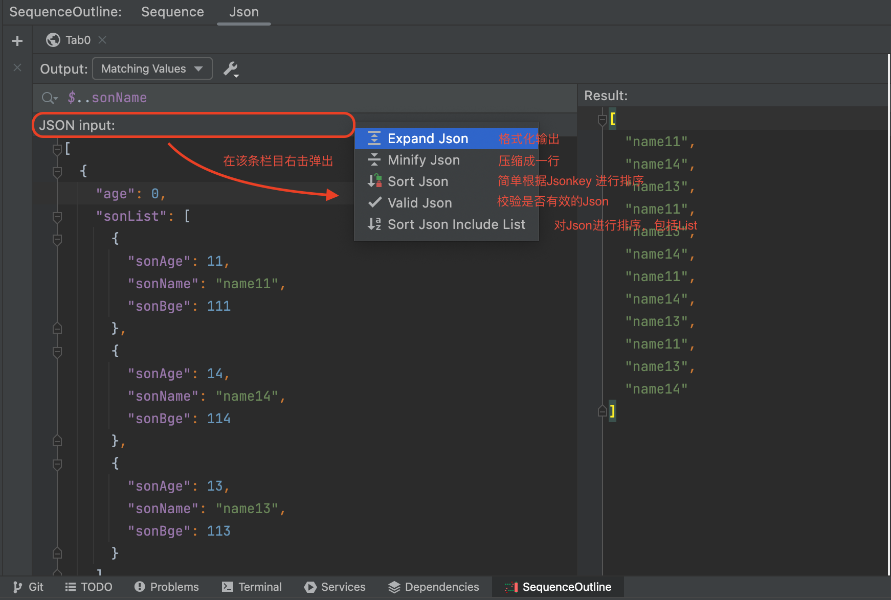
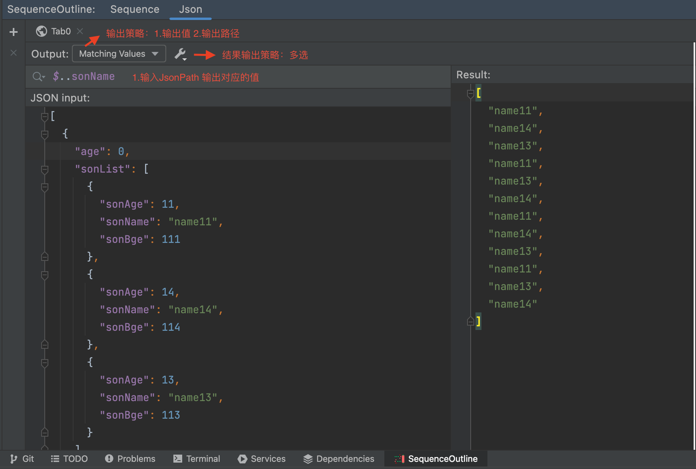
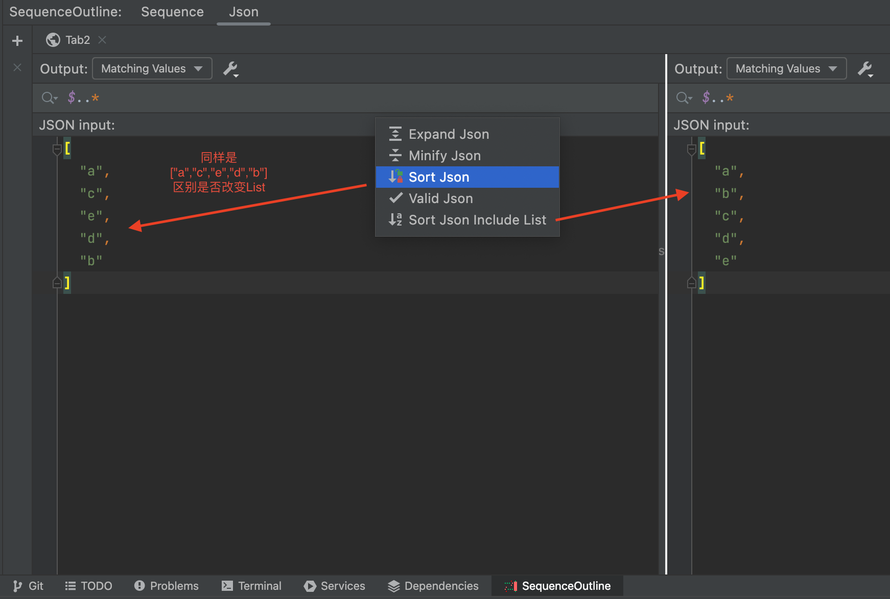
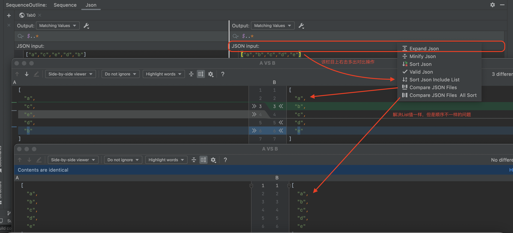

# SequenceOutline
> A Simple IntelliJ-based Sequence And Json Plugin
>
> 基于IntelliJ的时序图和Json操作插件 / IDEA 时序图和Json操作插件
>

## Function
### 1. Json Operation
- Expand Json
- Minify Json
- Sort Json
- Valid Json
- Diff Json
- JsonPath
- JsonPathValue

### 2. Sequence Outline
- scan code generate call tree
- generate plantUml base on call tree
- operation tree node add/delete/moveUp/moveDown/expand/collapse
- double click tree node jump to source code
- scan code and show tree node standalone configuration
- multi attribute configuration for scan and show, such as get/set/className/impClass/parentClass

## Some Screenshots
Json Operation

JsonPath

Sort Json

Diff Json

